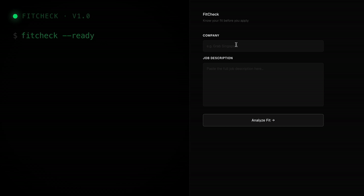

# FitCheck

**AI-powered job fit analyzer.** Paste a company name and JD — a multi-agent 
pipeline searches company intelligence, parses role requirements, scores your 
fit across three dimensions, and generates a tailored application strategy.

**Live demo:** [fitcheck-i7fi.onrender.com](https://fitcheck-i7fi.onrender.com)

> Built as a portfolio project to demonstrate production agentic AI engineering.
> If you're a hiring manager reading this — there's a question box at the bottom 
> of the results page for you.

---

## Demo

<!-- Replace with your actual GIF after recording -->


---

## Architecture

The core is a **4-node LangGraph agent** that runs sequentially with 
real-time SSE streaming to the frontend:
```
User Input (company + JD)
    ↓
[search_node]      → Tavily web search: company tech stack + culture
    ↓
[analyze_jd_node]  → Structure and extract JD requirements
    ↓
[score_node]       → LLM scores 3 dimensions → deterministic formula → fit score
    ↓
[report_node]      → Claude generates tailored application strategy report
    ↓
SSE stream → Frontend renders step-by-step in real time
```

Each node's completion triggers a frontend update via Server-Sent Events,
so users see live progress rather than waiting for a single response.

**Key engineering decisions:**

Scoring uses a hybrid approach: Claude reasons about fit across three dimensions 
(technical, domain, experience) and returns structured scores, but the final 
100-point score is calculated by deterministic code — not the LLM. This prevents 
the model from "rounding up" or making inconsistent judgments on the final number.

Error propagation flows through the state dict rather than Python exceptions, 
so the pipeline always completes and the report node handles both success 
and failure cases gracefully.

---

## Tech Stack

The backend is **FastAPI + LangGraph**, with Anthropic Claude (claude-sonnet-4-6) 
as the reasoning model and Tavily for real-time web search. The frontend is 
vanilla HTML with Berkeley Mono and Geist fonts — no framework, no build step. 
Deployed on Render with GitHub Actions CI running on every push.

---

## Local Setup
```bash
git clone https://github.com/YOUR_USERNAME/fitcheck
cd fitcheck
python -m venv .venv && source .venv/bin/activate
pip install -r requirements.txt

# Copy and fill in your API keys
cp .env.example .env

uvicorn app.main:app --reload --port 8000
```

You'll need a free [Tavily API key](https://tavily.com) and an 
[Anthropic API key](https://console.anthropic.com).

---

## CI/CD

Every push triggers GitHub Actions: dependencies install, pytest runs against 
the tools and API layer with mocked external calls. On merge to main, a 
successful test run automatically triggers a Render deployment via deploy hook.